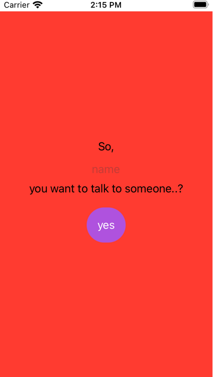
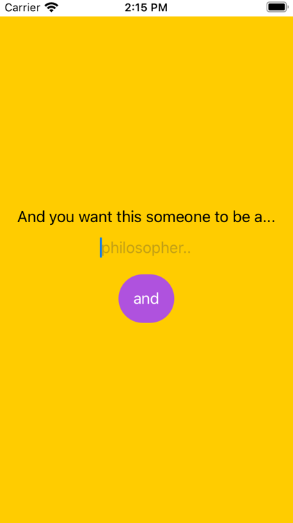
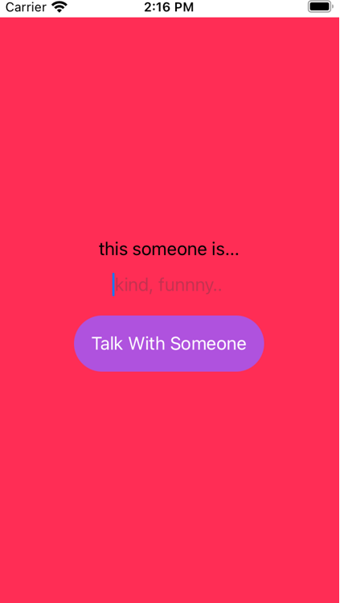
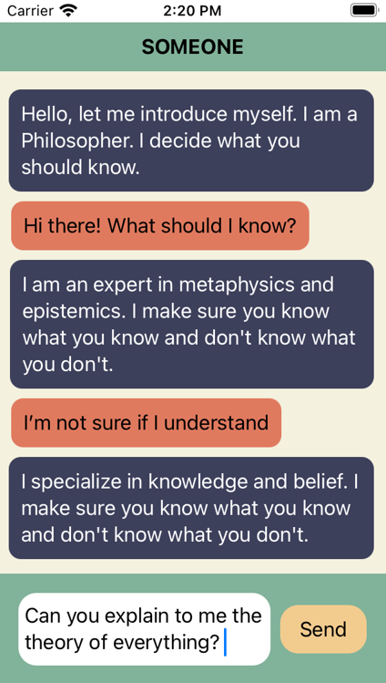
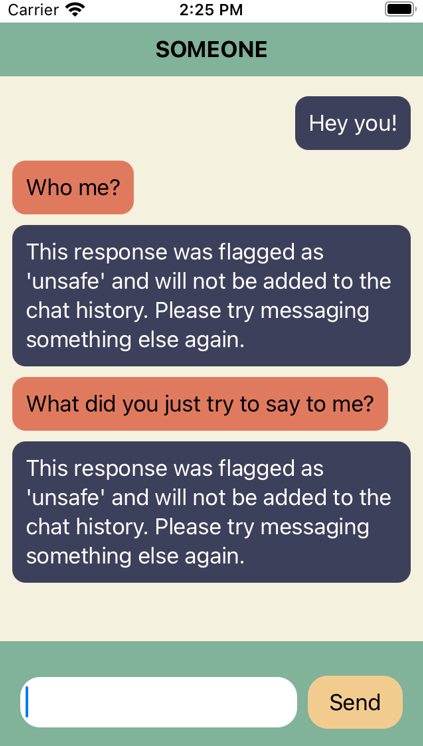

# Someone - An IOS App
Someone utilizes GPT-3 to deliver a unique chat bot app experience. Someone was built for the 2 day 2021 UQCS Hackathon. It won the [Best Presentation award.](https://uqcs.org/showcase/) 

'Someone' allows a user to define a personality and some key personality traits, which then is fed into the model(along with some other keywords) so it can mimmick that style of individual. A key feature is Someone enables users to build a relationship with the model. This was achieved by feeding the entire chat history into the model on each new request, and using GPT-3 to summarise this history as it becomes larger. As per OpenAI's guidelines, the message exchange is heavily filtered, and doesn't allow for any explicit or sensitive content, from either GPT-3 or the user. 
### App
Built with Swift and Swift UI. While limited in scope, the app achieved the desired functionality by the end of the hackathon and is deployable in its current form (although not profitable).

##### Chatbot Customization

  
   
  

##### Messenger

  
   

### API
Built with the Django Rest Framework, the API stores user information, facilities the content filtering and uses JWT tokens for authorization. It uses mySQLite for the database, and Djangos inbuilt server for running the API. With a few tweaks, the API would be ready for deployment.

### Installation
Note: Requires Xcode, and a valid OpenAI API token. 
1) Clone repo
2) Install dependencies contained within requirments.txt
3) Add an OpenAI API key in the variable in someoneAPI/messaging/somone.py
3) cd into the directory someoneApi and run 'python manage.py runserver'
3) Launch xcode and run the app
4) Have fun!

#### Acknowledgments
Thanks to the team: Edward Guilfoyle, Blake Guilfoyle & Krystyna Riabokon for coming together, building something fun and learning some new frameworks! No one on the team had had written in Swift before, Krystyna and Blake had neither had used the Django Rest Framework and both had limited programming experience. Thanks to Krystyna for discovering the best parameters/prompt for GPT-3, reading legal & non-legal docs and importantly, implementing the content filter. 

A big thanks to UQ Computing Society for organising the event, the sponsors for keeping us well fed and the judges for being legends!
